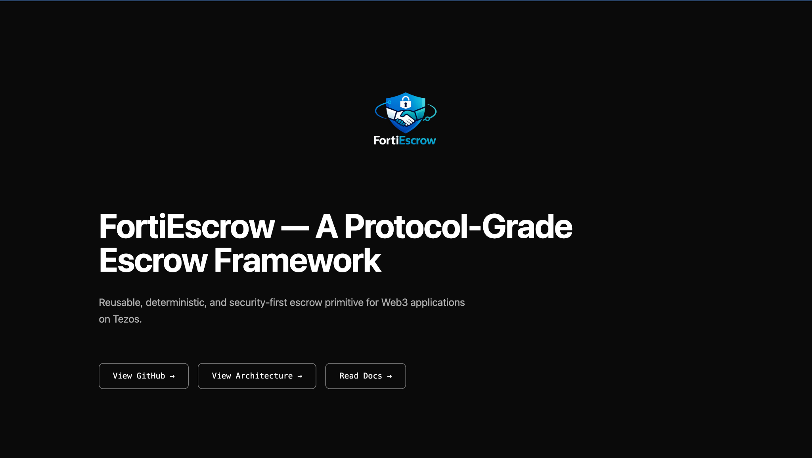

# FortiEscrow Landing Page

Official landing page for FortiEscrow — a protocol-grade escrow framework on Tezos.



## Overview

FortiEscrow is a reusable, deterministic, and security-first escrow primitive for Web3 applications. This landing page showcases the framework's core features and architecture.

## Tech Stack

- **Framework**: Next.js 14
- **Language**: TypeScript
- **Styling**: Tailwind CSS
- **Package Manager**: npm

## Getting Started

### Prerequisites

- Node.js 18+
- npm

### Installation

```bash
git clone https://github.com/FortiEscrow/lending-page.git
cd lending-page
npm install
```

### Development

```bash
npm run dev
```

Open [http://localhost:3000](http://localhost:3000) in your browser.

### Build

```bash
npm run build
npm start
```

## Features

- 🎯 Animated hero section with FortiEscrow logo
- 🏗️ Complete architecture overview
- 🔒 Security-first design principles
- 📱 Fully responsive design
- ⚡ Optimized performance

## Deployment

Deploy to Vercel or any Node.js hosting platform:

```bash
npm run build
npm start
```

## License

MIT

---

**Repository**: [FortiEscrow/lending-page](https://github.com/FortiEscrow/lending-page)

## Project Structure

```
fortiescrow-landing/
├── public/              # Static assets
├── src/
│   ├── app/            # Next.js app router
│   ├── components/     # React components
│   ├── lib/            # Utilities and helpers
│   ├── config/         # Configuration files
│   ├── hooks/          # Custom hooks
│   ├── styles/         # Global styles
│   └── types/          # TypeScript types
├── tailwind.config.ts  # Tailwind configuration
└── next.config.js      # Next.js configuration
```

## License

Proprietary - FortiEscrow
